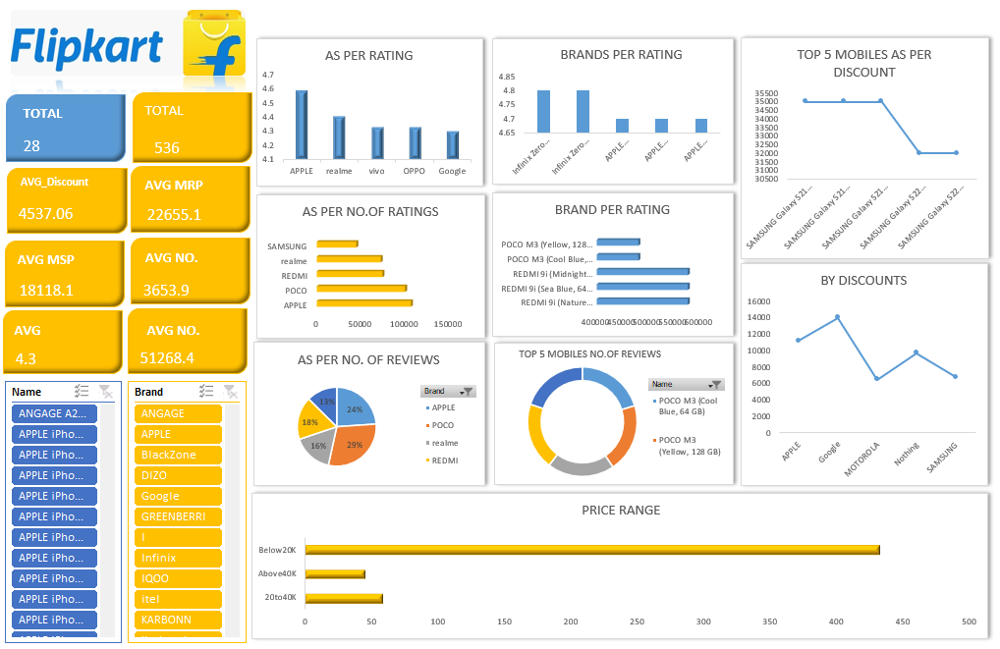

#  Flipkart Sales Performance Dashboard | Excel Project 

## Project Overview

This project presents an interactive Flipkart Sales & Performance Dashboard built using Microsoft Excel.

The dashboard analyzes sales data to generate meaningful business insights such as revenue trends, category performance, and customer behavior.

The project follows a complete data analysis workflow:

Raw Data → Data Cleaning → Data Analysis → Dashboard Creation → Business Insights
---

## Tools & Techniques Used  

- **Microsoft Excel**
  - Pivot Tables  
  - Pivot Charts  
  - Slicers & Interactive Filters  
  - Conditional Formatting  
  - Data Cleaning Functions (TEXT, IF, VLOOKUP/XLOOKUP, etc.)  

##  Project Structure  

-  Flipkart_Data_Visualization.xlsx` – Complete interactive dashboard  
- Dashboard_Overview.png` – Visual preview of final output  
---

##  Dashboard Preview  

##  Business Insights Generated  

- Identified top-performing product categories and revenue drivers  
- Analyzed sales trends and seasonal performance  
- Compared product-level and category-level contribution  
- Highlighted patterns affecting overall profitability  
- Enabled performance tracking using dynamic filters  

---
##  Key Objectives  

- Convert raw sales data into meaningful insights  
- Build an executive-level dashboard for business monitoring  
- Improve reporting efficiency through automation  
- Demonstrate practical Excel-based analytics skills  

---

##  Dashboard Features  

- Interactive slicers for dynamic filtering  
- KPI-based performance tracking  
- Category-wise and time-based comparison  
- Clean and professional dashboard layout  

---
##  Author  

**Shreya Chanore**  

